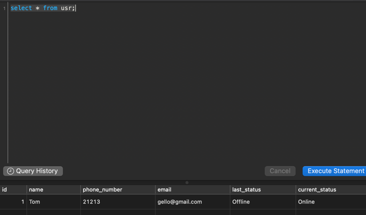

#Задание для компании Протец, НТЦ на вакансию  Java Developer

##Инстркуция по запуску программы

###Запуск программы
``````
mvn spring-boot:run
``````
###Запуск тестов
``````
mvn test
``````


###Примеры REST запросов


``````
Get Request
http://localhost:8080/users
``````


``````
Post Request
http://localhost:8080/users
``````


``````
Get Request
http://localhost:8080/users/1
``````


``````
Delete Request
http://localhost:8080/users/1
``````


``````
Put Request
http://localhost:8080/users/1
``````


``````
Put Request
http://localhost:8080/users/1/status/Online
``````




прошло 5 минут 

